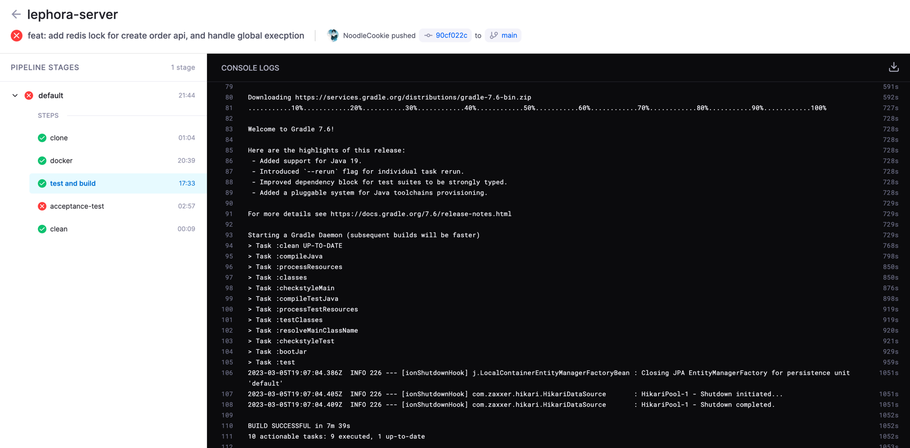
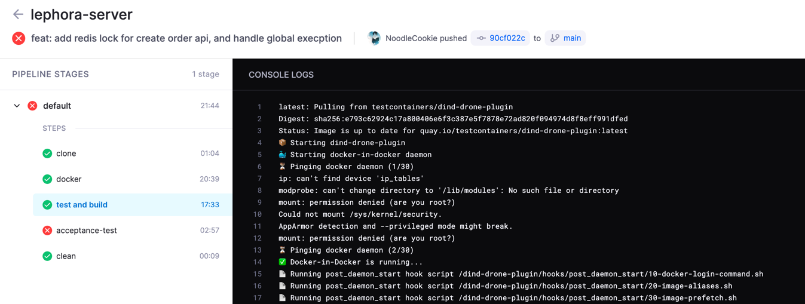
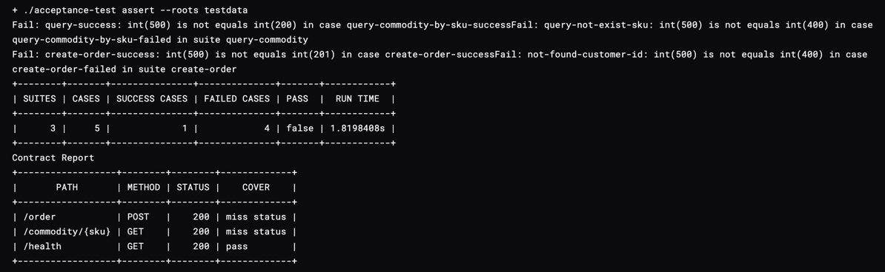
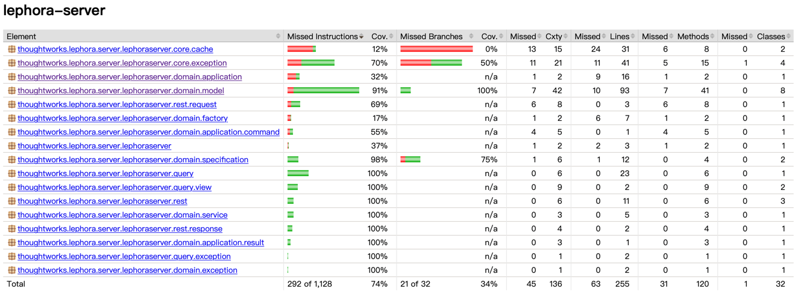

# 破茧作业


## Lephora电子商城


迭代计划：
 + 业务：
    1. 前端包含两个页面，详情页，下单页，通过下单按钮跳转
    2. 后端提供API接口
 + 技术：
    1. 基本开发脚手架（前端选型Vue3 + axios，后端springboot3.0.3 + JPA）
    2. 基于前后端分离的完整的协同开发/发布模式
    3. 完整的测试策略
    4. 后端采用代码架构采用DDD领域驱动和CQRS命令查询职责分离模式
 + 基础设施：
    1. 数据库采用关系型postgres
    2. 流水线采用drone ci
    3. 缓存服务为redis


开发/发布模式：

+ 原则： 契约先行。与先开发好后端接口再生成API文档的模式不同，开发过程中，应该先分析需求内容，约定好契约，前后端再分别基于契约进行开发。

+ 实践：
    + openapi独立在前后端项目仓库之外
    + 开发过程中，先发布openapi，前端使用orval自动生成axios代码，以及prism生成mock服务，后端使用契约测试cover接口schema校验
    + dev环境下，开发前，先发布openapi。开发完毕后，发布代码，ci运行端到端测试以及基于openapi的branch:master契约测试，获得契约报告
    + prod环境下，发布新版本v1.0.0前，给当前版本openapi打上tag为v1.0.0，ci基于openapi的tag:v1.0.0进行契约测试，测试成功才能成功发布，每个版本的服务，都会对应一个由开发人员商议和发布的openapi版本

---

#### 任务分解

---
1. 初始化服务，搭建框架(done)
> 后端 选型Spring boot 3 + postgres + redis
>
> 前端 vue + axios + vue_router (略)
> 
> 流水线 drone ci
> 
> 代码仓 github
---
2. 需求：(done)

用户故事：
```text
story_1：

as 用户
when 在浏览器中输入url https://{host}/commodity/{商品编号}
then 进入到商品详情页面，在页面中查看到商品信息，包括图片，标题，描述和价格
```

拆卡：

```text
-------------------------------------------------
card 01: 用户可以进入到商品详情页

as 用户
when 在浏览器通过url输入 `https://{host}/commodity/{商品编号}`
then 跳到商品详情页面，查看到该商品信息
-------------------------------------------------
ac1:
as 用户
when 在浏览器通过url输入 `https://{host}/commodity/000001`
then 跳到商品详情页面，查看到该商品的名称，描述，价格和所有图片
-------------------------------------------------
ac2:
as 用户
when  在浏览器通过url输入不存在的sku `https://{host}/commodity/999999`
then 在浏览器看到提示信息，告诉当前查看商品不存在
-------------------------------------------------
ac3:
as 用户
when  在浏览器通过url输入不合法的sku `https://{host}/commodity/XXXXXX`
then 在浏览器看到提示信息，告诉当前查看商品不存在
-------------------------------------------------
> task0. 前/后端：约定获取商品详情的API契约
> task1. 前端：添加路由，跳转到商品详情页 
> task2. 前端：创建商品详情组件
> task3. 前端：从mock服务接口获取商品详情，渲染组件
> task4. 后端：提供rest接口/commodity/<commodity_sku>获取数据库商品详情
> task5. 后端：校验sku格式为`^\d{6}$`，由六位数字组成；查找非法的sku->返回有errorCode和详细的message的response
> task6. 后端：检查商品是否存在；查找不存在的sku->返回有errorCode和详细的message的response
> task7. 前/后端：对接联调
-------------------------------------------------
```


story_2：

```
as 用户
when 在商品详情页，点击下单按钮
then 弹出表单，填写订单信息并且提交，看到订单创建完成，状态为待支付
```

拆卡：

```text
-------------------------------------------------
card 02: 用户可以创建订单

as 用户
when 在商品详情页/commodity/000001，点击下单按钮，在表单中填写地址信息（收货人，联系电话，物理地址）以及商品数量，点击确认
then 收到弹窗提示，商品已经创建完成，状态为"待支付"
-------------------------------------------------
ac1:
as 用户
when 在000001商品的详情页点击下单
then 弹出表单，并且可以填写地址信息（收货人，联系电话，物理地址）以及商品数量，并且均为必填项，
     收货人名字长度不超过200字，联系电话有格式校验，物理地址不超过500字，商品数量不超过99999999
-------------------------------------------------
ac2:
as 用户
when 在000001商品的详情页点击下单，并且填写完地址信息和购买数量后，点击确认
then 收到弹窗提示，商品已经创建完成，状态为"待支付"
-------------------------------------------------
ac3:
as 用户
when 在000001商品的详情页点击下单，并且填写完地址信息和购买数量后，第一次点击确认
then 确认按钮置灰，等待返回
-------------------------------------------------
ac4:
as 用户
when 在000001商品的详情页点击下单，并且填写完地址信息和购买数量后，快速连续多次点击确认
then 收到弹窗提示，商品已经创建完成，状态为"待支付"，并且只有一条订单被创建
-------------------------------------------------
> task0. 前/后端：约定创建订单的API契约
> task1. 前端：创建下单表单组件，可以通过点击事件唤出组件
> task2. 前端：给表单组件属性添加约束条件
> task3. 前端：添加确认按钮的业务事件，在订单页面获取唯一的token值后（mock），调用后端接口创建订单
> task4. 前端：给下单按钮添加防抖动，避免重复下单
> task5. 后端：提供rest接口POST/order创建订单
> task6. 后端：下单时，校验sku和用户id的格式，以及是否存在->验证失败后，返回有errorCode和详细的message的response
> task7. 后端：下单时，校验商品数量是否过大(<=99999999)或者过小(>=1)->验证失败后，返回有errorCode和详细的message的response
> task8. 后端：下单时，校验订单地址信息是否过长(<=500)或者收货人电话长度不合法(!=11)，以及收货人姓名格式(<=200)->验证失败后，返回有errorCode和详细的message的response
> task9. 后端：短时间连续重复多次使用同一个交易id调用下单接口时->只有一次创建成功，其余时候均返回错误信息
> task10. 前/后端：对接联调
-------------------------------------------------
```


---

3. 工程链路（done）

与先开发好后端接口再生成API文档的模式不同，开发过程中，应该先分析需求内容，约定好契约，前后端再分别基于契约进行开发；

openapi独立在前后端项目仓库之外；

开发过程中，先发布openapi，前端使用orval自动生成axios代码，以及prism生成mock服务，后端使用契约测试cover接口schema校验（acceptance test）；

dev环境下，开发前，先发布openapi。开发完毕后，发布代码，ci运行端到端测试以及基于openapi的branch:master契约测试，获得契约报告；

prod环境下，发布新版本v1.0.0前，给当前版本openapi打上tag为v1.0.0，ci基于openapi的tag:v1.0.0进行契约测试，测试成功才能成功发布，每个版本的服务，都会对应一个由开发人员商议和发布的openapi版本



---

4. 资产管理(to do)

包括各类制品镜像，运行报告，数据库数据等。

镜像保存到私有仓库，各类报告前期保存至本地，后期可以接入管理平台或者Jfrog直接统一管理，数据库可以使用云数据库。

---

5. 开发原则(后端)(done)

代码架构采用DDD领域驱动和CQRS命令查询职责分离模式进行开发，编写代码使用TDD模式，前后端对接以契约先行（openapi spec）为原则。

---

6. 测试策略(后端)(done)

+ 测试环境：
    + 本地环境：mac os，使用自动化脚本构建容器化服务
    + CI环境：drone ci，使用docker in docker的环境搭配插件构建测试环境
+ 角色：
    + dev：单元测试，jacoco测试报告覆盖率大于55%；分层测试，通过mock隔离层与层进行测试
    + qe & dev：验收测试，编写验收测试，在CI和本地运行测试，获得测试报告
+ 测试类型：
    + 单元测试：owner dev
    + 端到端测试：owner dev & qe
    + 契约测试：owner dev & qe
    + 回归测试：qe






